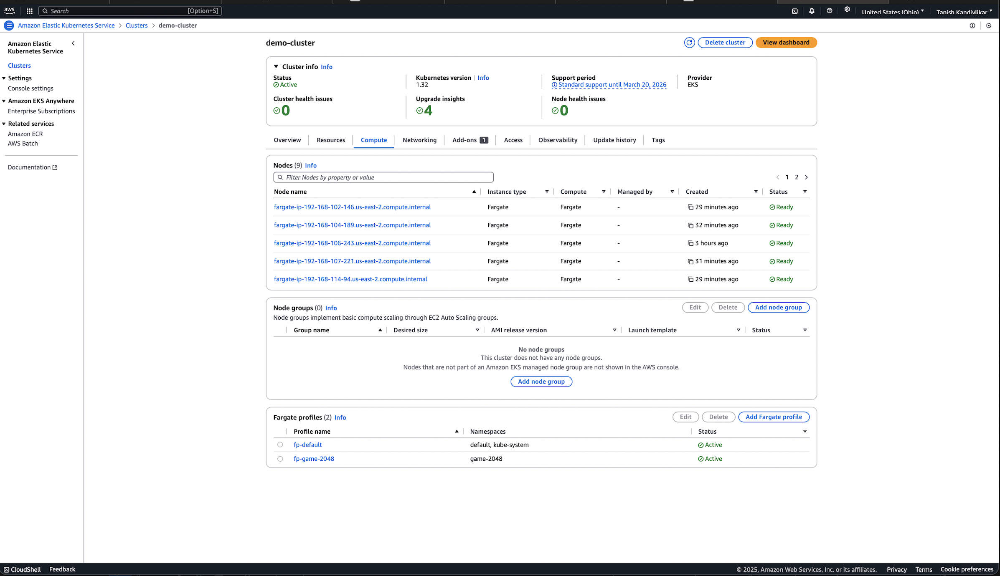
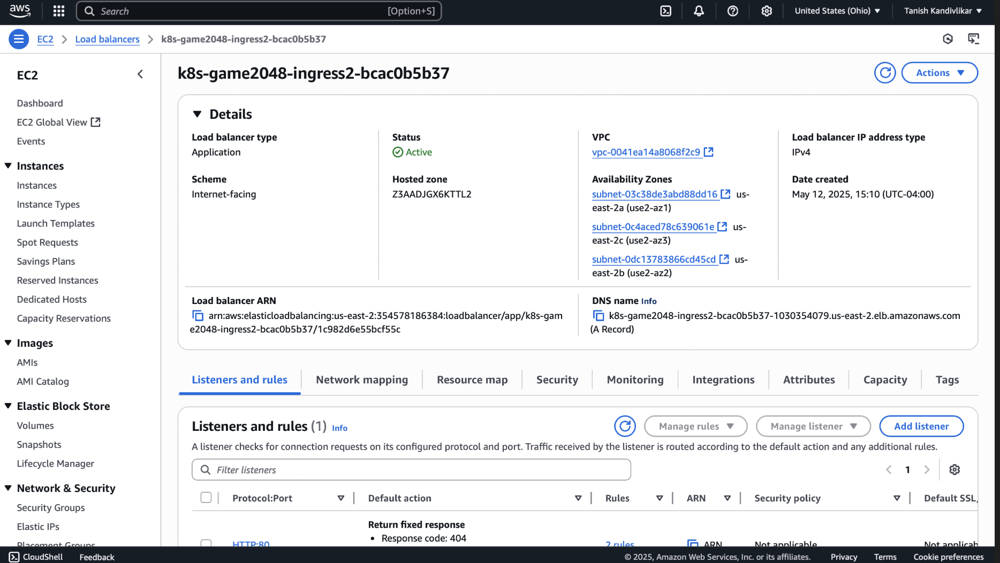
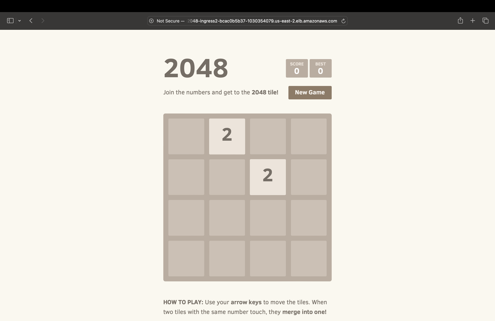

# 🎮 Deploying the 2048 Game on AWS EKS with Fargate and ALB Ingress Controller

This project demonstrates how to deploy the popular 2048 web app on **Amazon EKS** using **AWS Fargate**, with secure access via **IAM Roles for Service Accounts (IRSA)** and public exposure using the **AWS ALB Ingress Controller**.

---

## 🚀 Architecture Overview

- **Kubernetes Cluster**: Hosted on Amazon EKS
- **Compute**: Pods run serverlessly on AWS Fargate
- **Ingress**: Application Load Balancer (ALB) via AWS Load Balancer Controller
- **Security**: IAM roles via OIDC for pod-level access to AWS services
- **App**: 2048 game deployed as a Kubernetes Deployment with 5 replicas

---

## 🌐 Live URL

> http://k8s-game2048-ingress2-bcac0b5b37-1030354079.us-east-2.elb.amazonaws.com

*(Replace with your actual ALB DNS name)*

---

## 🛠️ Tech Stack

- Amazon EKS
- AWS Fargate
- Kubernetes (kubectl, eksctl)
- AWS ALB Ingress Controller (Helm)
- IAM OIDC Provider
- YAML-based Deployments

---

## 📦 Components Deployed

- **Namespace**: `game-2048`
- **Fargate Profile**: Matches the `game-2048` namespace
- **Deployment**: 5 replicas of the 2048 app
- **Service**: Internal ClusterIP for routing to pods
- **Ingress**: ALB pointing to the Service, exposed publicly
- **IAM Policy**: Granular ALB permissions via IRSA
- **Helm Chart**: For AWS Load Balancer Controller

---

## ✅ Steps Followed

1. **Create EKS Cluster using `eksctl`**
2. **Associate IAM OIDC Provider with the Cluster**
3. **Download and Apply IAM Policy for ALB Controller**
4. **Create a ServiceAccount with IAM Role (IRSA)**
5. **Install ALB Controller via Helm**
6. **Create Fargate Profile for `game-2048`**
7. **Deploy the 2048 App (Deployment + Service + Ingress)**
8. **Verify ALB is created and game is accessible**

---

## 📸 Screenshots

| EKS Cluster | ALB DNS | 2048 Game |
|-------------|---------|-----------|
|  |  |  |

*(Add your own screenshots in a `/screenshots` folder for best effect)*

---

## 🧠 What This Proves

- ✅ End-to-end EKS setup and management
- ✅ Secure AWS resource access using IAM + OIDC
- ✅ Helm chart usage in Kubernetes
- ✅ Serverless compute with AWS Fargate
- ✅ Real-world Ingress + Load Balancing configuration
- ✅ Production-grade deployment pipeline skills

---

## 🧹 Cleanup

To delete the cluster and avoid charges:

```bash
eksctl delete cluster --name demo-cluster --region us-east-2
